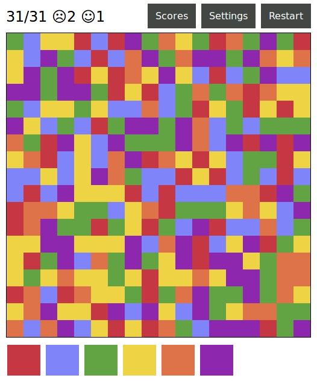

Flood JS
========

This is a crude, quick&dirty reimplementation of [Open Flood](https://play.google.com/store/apps/details?id=com.gunshippenguin.openflood&hl=en),
and similar games.

The gameplay is extremely simple:

The game board is initialized with random colors.
Clicking one of the colored buttons below the board will flood-fill the contiguous area starting from the upper left corner with the selected color.
By choosing the right sequence of color changes you can gradually enlarge that area.
The goal is to paint the entire board with a single color - within a pre-determined number of steps.

Installation
------------

Clone the repo or just download [flood.html](flood.html) and open it in the browser.

Excuses^WMotivation
-------------------

I will readily admit that this thing is rather crude.
I made it because I've seen a similar game on a co-worker's phone, but I don't have an Android device so I could not play it.
Instead of hunting down an existing implementation I've decided to write it myself, and I thought it would be a good opportunity to learn
about HTML5 Canvas, Javascript, and the flood fill algorithm. It looked like a good idea at the time.

I'd also like to use this venue to say that CSS sucks balls.
 
